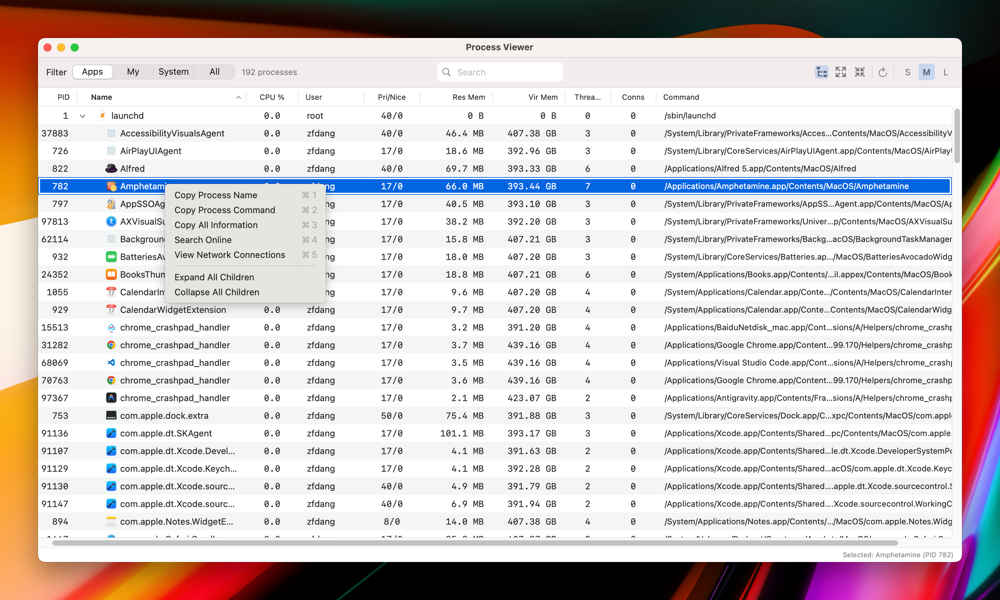
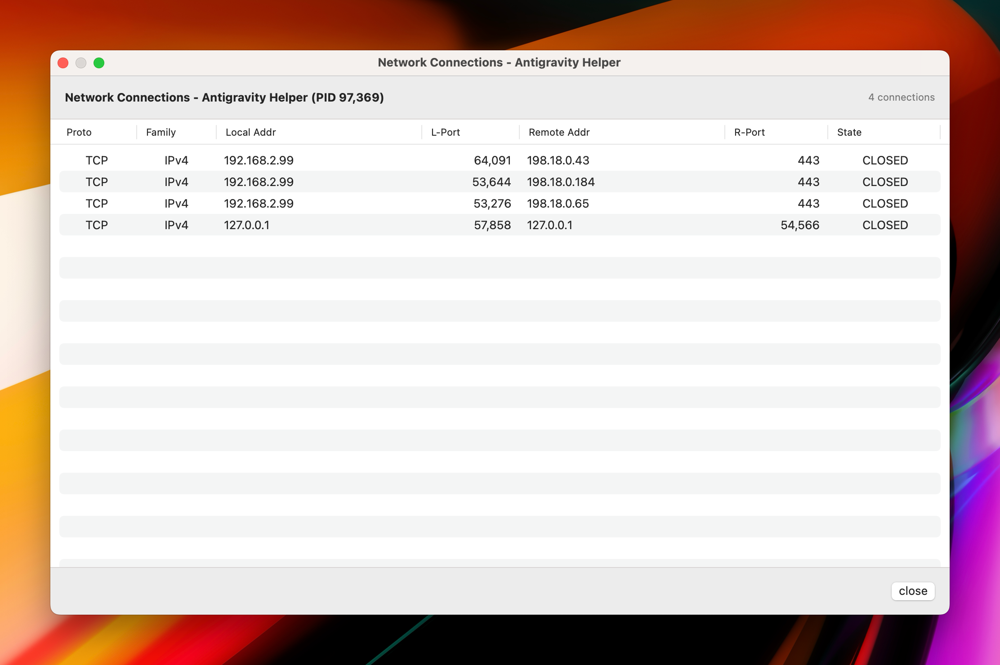
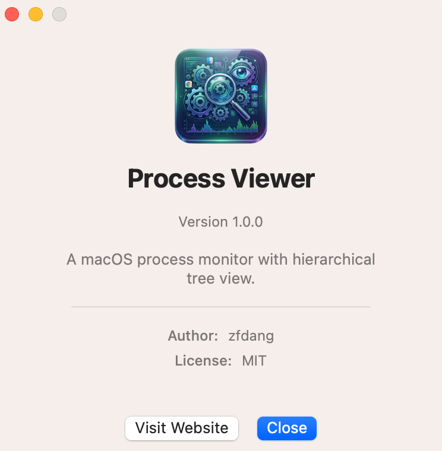

# Process Viewer

[中文版](README.md)

A native macOS application for viewing and monitoring system processes with a hierarchical tree display.


[](https://github.com/zfdang/process-viewer-for-macos/actions/workflows/build-release.yml)

## Screenshots


 






## Features

- **Hierarchical Process Tree**: View processes in a parent-child tree structure
- **Flat View Mode**: Toggle between hierarchy and flat list view
- **Network Connections**: View active network connections for any process, including local/remote addresses and ports
- **Multilingual Support**: English and Chinese with auto-detection and manual override
- **Resizable Columns**: Drag column borders to adjust width
- **Sortable Columns**: Click column headers to sort
- **Process Filtering**: Filter by Apps / My Processes / System / All
- **Search**: Real-time search by name, command, or PID
- **Auto Refresh**: Automatic 5-second refresh with state preservation
- **App Icons**: Displays application icons for .app processes
- **Adjustable Row Size**: Choose between Small, Medium, or Large row heights
- **Expand/Collapse All**: Quick buttons to expand or collapse the entire tree
- **Copy Info**: Right-click to copy detailed process information
- **State Preservation**: Maintains scroll position, selection, and expanded state across refreshes

## Process Information Displayed

| Column | Description |
|--------|-------------|
| PID | Process ID |
| Name | Process name with app icon |
| CPU % | CPU usage (color-coded) |
| Connections | Active network connection count |
| User | Owner username |
| Pri/Nice | Priority and nice value |
| Res Mem | Resident memory usage |
| Vir Mem | Virtual memory usage |
| Threads | Thread count |
| Command | Full executable path |

## Requirements

- macOS 13.0 or later
- Xcode 15.0 or later (for building from source)

## Installation

### Download Release

1. Go to [Releases](https://github.com/zfdang/process-viewer-for-macos/releases)
2. Download the latest DMG or ZIP file
3. Open the DMG and drag "Process Viewer" to Applications, or extract the ZIP
4. Right-click the app and select "Open" (first time only, to bypass Gatekeeper)

### Build from Source

1. Clone the repository:
   ```bash
   git clone https://github.com/zfdang/process-viewer-for-macos.git
   ```

2. Open in Xcode:
   ```bash
   cd process-viewer-for-macos
   open ProcessViewer.xcodeproj
   ```

3. Build and run (⌘R)

## Keyboard Shortcuts

| Shortcut | Action |
|----------|--------|
| ⌘R | Refresh process list |

## Note on Permissions

This app requires **disabled App Sandbox** to read all system process information. Without this, it would only see a limited subset of processes.

## Gatekeeper Notice

This project is **free and open-source software** and is not enrolled in the Apple Developer Program ($99/year). As a result, macOS will display a warning: **"Cannot verify that this app is free from malware"** or **"The developer cannot be verified"**.

This is a standard macOS security mechanism (Gatekeeper) and does **not** indicate any risk with the software.

### How to Open the App

**Method 1: Right-click to Open (Recommended)**
1. Right-click (or Control-click) on the app
2. Select "Open" from the context menu
3. Click "Open" in the dialog that appears
4. This only needs to be done once

**Method 2: System Settings**
1. Try to open the app normally (it will be blocked)
2. Go to **System Settings** → **Privacy & Security**
3. Scroll down to find the blocked app message
4. Click "Open Anyway"

**Method 3: Terminal Command**
If the above methods don't work, you can remove the quarantine attribute using Terminal:
```bash
xattr -rd com.apple.quarantine /Applications/Process\ Viewer.app
```

> [!NOTE]
> You can verify this app's source code on [GitHub](https://github.com/zfdang/process-viewer-for-macos). The releases are built automatically via GitHub Actions from the source code in this repository.

## Tech Stack

- **SwiftUI**: Application structure and toolbar
- **AppKit (NSOutlineView)**: Process tree with resizable/sortable columns
- **sysctl / libproc**: System APIs for process information

## License

MIT License - see [LICENSE](LICENSE) for details.

## Author

- **zfdang** - [GitHub](https://github.com/zfdang)

## Links

- [Website](https://proc.zfdang.com)
- [GitHub Repository](https://github.com/zfdang/process-viewer-for-macos)
- [Report Issues](https://github.com/zfdang/process-viewer-for-macos/issues)
