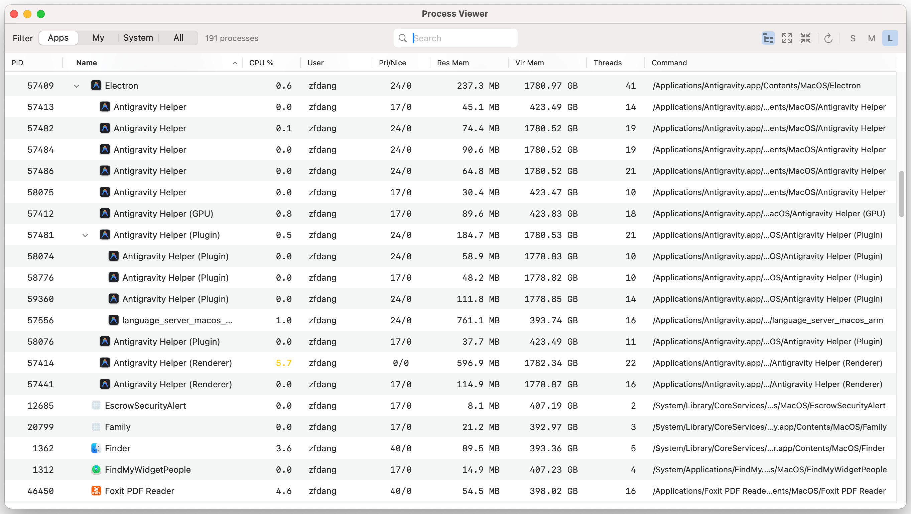

# Process Viewer

[English](README.md)

一款原生 macOS 应用，用于查看和监控系统进程，支持层级树状显示。


[](https://github.com/zfdang/process-viewer-for-macos/actions/workflows/build-release.yml)

## 截图




## 功能特性

- **层级进程树**：以父子树状结构查看进程关系
- **平铺视图模式**：在层级视图和平铺列表之间切换
- **多语言支持**：支持中英文，自动检测系统语言，可手动切换
- **可调整列宽**：拖动列边框调整宽度
- **可排序列**：点击列标题进行排序
- **进程过滤**：按应用 / 我的进程 / 系统进程 / 全部进行过滤
- **搜索**：按名称、命令或 PID 实时搜索
- **自动刷新**：每 5 秒自动刷新，保持状态
- **应用图标**：显示 .app 进程的应用图标
- **可调整行高**：可选择小、中、大三种行高
- **全部展开/折叠**：快速展开或折叠整个树
- **复制信息**：右键复制详细进程信息
- **状态保持**：刷新时保持滚动位置、选中状态和展开状态

## 显示的进程信息

| 列名 | 描述 |
|------|------|
| 进程 ID | 进程标识符 |
| 名称 | 进程名称及应用图标 |
| CPU % | CPU 使用率（颜色标记） |
| 用户 | 所属用户名 |
| 优先级 | 优先级和 nice 值 |
| 常驻内存 | 常驻内存使用量 |
| 虚拟内存 | 虚拟内存使用量 |
| 线程 | 线程数量 |
| 命令 | 完整可执行文件路径 |

## 系统要求

- macOS 13.0 或更高版本
- Xcode 15.0 或更高版本（从源码构建时需要）

## 安装

### 下载发布版

1. 前往 [Releases](https://github.com/zfdang/process-viewer-for-macos/releases) 页面
2. 下载最新的 DMG 或 ZIP 文件
3. 打开 DMG 并将 "Process Viewer" 拖到应用程序文件夹，或解压 ZIP 文件
4. 首次运行时，右键点击应用选择"打开"（以绕过 Gatekeeper）

### 从源码构建

1. 克隆仓库：
   ```bash
   git clone https://github.com/zfdang/process-viewer-for-macos.git
   ```

2. 使用 Xcode 打开：
   ```bash
   cd process-viewer-for-macos
   open ProcessViewer.xcodeproj
   ```

3. 构建并运行（⌘R）

## 快捷键

| 快捷键 | 功能 |
|--------|------|
| ⌘R | 刷新进程列表 |

## 权限说明

此应用需要**禁用 App Sandbox** 才能读取所有系统进程信息。否则只能看到有限的进程子集。

## 技术栈

- **SwiftUI**：应用架构和工具栏
- **AppKit (NSOutlineView)**：支持调整列宽和排序的进程树
- **sysctl / libproc**：获取进程信息的系统 API

## 许可证

MIT 许可证 - 详见 [LICENSE](LICENSE)。

## 作者

- **zfdang** - [GitHub](https://github.com/zfdang)

## 链接

- [网站](https://proc.zfdang.com)
- [GitHub 仓库](https://github.com/zfdang/process-viewer-for-macos)
- [问题反馈](https://github.com/zfdang/process-viewer-for-macos/issues)
